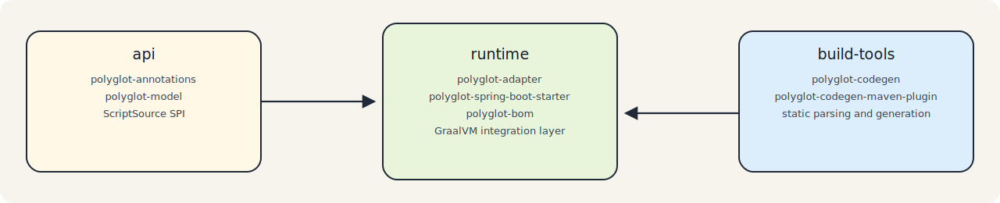

# Architecture

## Overview

`polyglot-adapter` is a multi-module Maven repository organized around a runtime adapter for dynamic languages built on top of the GraalVM Polyglot API.

The codebase is split into three logical layers:

```text
api
  ├─ polyglot-annotations
  └─ polyglot-model
runtime
  ├─ polyglot-bom
  ├─ polyglot-adapter
  └─ polyglot-spring-boot-starter
build-tools
  ├─ polyglot-codegen
  └─ polyglot-codegen-maven-plugin
```

This split is intentional:

- `api` contains shared contracts and does not depend on GraalVM execution or Spring
- `runtime` contains the adapter API implementation and application integration
- `build-tools` owns static analysis and source generation



## Architectural Responsibilities

### API Layer

The API layer is the common vocabulary shared by runtime and tooling.

`polyglot-annotations` provides:

- `@PolyglotClient`
- `SupportedLanguage`
- `Convention`

`polyglot-model` provides:

- the contract model used by generators and parsers
- the portable polyglot type system
- `LanguageParser` and `ScriptDescriptor`
- `CodegenConfig`
- the `ScriptSource` SPI used by the runtime

The API layer is deliberately free of GraalVM `Context`, Spring beans, and code generation implementation details.

### Runtime Layer

The runtime layer is the actual GraalVM polyglot integration layer. It adapts Java contracts to guest-language execution.

`polyglot-adapter` provides:

- `AbstractPolyglotExecutor`
- `PyExecutor`
- `JsExecutor`
- `PolyglotHelper`
- `ScriptSource` implementations for classpath, filesystem, memory, and delegation
- runtime exception types

`AbstractPolyglotExecutor` is a shared runtime base class used by the repository implementation. It should not be treated as a stable external subclassing SPI.

`polyglot-spring-boot-starter` adds:

- autoconfiguration for Python and JavaScript executors
- one `ScriptSource` bean per enabled language
- `@EnablePolyglotClients` scanning
- `PolyglotClientFactoryBean`
- optional actuator health/info and Micrometer metrics integration
- startup warmup, optional script preload, and fail-fast client validation

Current fail-fast validation in the Spring starter works by eagerly instantiating discovered client
beans during startup, not by a separate metadata-only validation pass.

`polyglot-bom` is a consumption aid. It aligns runtime module versions with GraalVM dependencies for applications using the adapter.

### Build-Tools Layer

The build-tools layer performs static contract extraction and Java source generation.

`polyglot-codegen` provides:

- parser dispatch through `DefaultContractGenerator`
- Python contract parsing
- Java type rendering
- Java interface source generation
- a small CLI entry point

`polyglot-codegen-maven-plugin` integrates the generator into Maven and registers generated sources during `generate-sources`.

JavaScript contract generation is not implemented yet. The runtime supports JavaScript execution as
an experimental bounded path, but the current code generator throws
`UnsupportedOperationException` for JavaScript contracts.

## Adapter Flow On Top of GraalVM

The runtime adapter follows this flow:

1. The application chooses a `ScriptSource`.
2. An executor creates or receives a GraalVM `Context`.
3. The executor resolves the script name from the Java interface name.
4. The script is loaded and evaluated.
5. The executor validates that the expected guest export exists.
6. `bind(...)` creates a Java proxy that delegates interface method calls into the guest runtime.

### Python Path

`PyExecutor` converts the interface simple name from camel case to snake case to locate the script. For `ForecastService`, it looks for `forecast_service.py`.

After evaluation it resolves the exported contract by interface name:

- first from polyglot bindings
- then from Python language bindings

It supports:

- class-style exports, where the exported value is executable and instantiated once
- object-style exports, where the exported value is a dictionary-like map of functions

Resolved Python targets are cached per Java interface using weak references. Source caching is also
per Java interface, and there is no automatic hot reload when scripts change after startup.
The startup preload path is separate raw script evaluation and does not populate those interface
caches.

### JavaScript Path

`JsExecutor` resolves the script name the same way, for example `forecast_service.js`.

It evaluates the script once per interface and expects interface methods to map to executable
JavaScript functions in language bindings. There is no separate exported-object convention like the
Python path currently uses. This JavaScript path should be treated as experimental support before
`1.0.0`.

Starter-managed executors are singleton beans that serialize access to their shared GraalVM
`Context`. This makes them suitable for normal concurrent Spring application use, but it does not
imply source isolation or live reload semantics.

## Script Resolution

The runtime depends on `ScriptSource` instead of performing I/O directly. Current implementations are:

- `ClasspathScriptSource`
- `FileSystemScriptSource`
- `InMemoryScriptSource`
- `CompositeScriptSource`
- `SpringResourceScriptSource` in the Spring starter

This abstraction was introduced during the runtime refactor that replaced older resource-loading assumptions with a single SPI shared across execution environments.

## Code Generation Flow

The build-time pipeline is:

1. Discover supported script files.
2. Infer language from file extension.
3. Build a `ScriptDescriptor`.
4. Parse the script into a `ContractModel`.
5. Render deterministic Java interfaces.
6. Write generated sources under the configured output package.

Current parser coverage:

- Python: implemented, including class-style and dictionary-style exports
- JavaScript: declared extension point only, not implemented

## How Java Interacts With Dynamic-Language Code

At runtime, Java does not call Python or JavaScript through handwritten `Value` member lookups. Instead:

1. a Java interface defines the contract
2. a script is resolved by convention through `ScriptSource`
3. the adapter evaluates the script inside a GraalVM `Context`
4. the adapter binds the contract and delegates method calls through GraalVM interop

This is the core architectural role of `polyglot-adapter`: it is not a replacement runtime, but an adapter API layered on top of GraalVM polyglot execution.

## Code Generation and Runtime Integration

The code generation tooling is intentionally separate from runtime execution, but both parts are designed to work together.

- `polyglot-codegen` parses supported script contracts into a neutral model
- `polyglot-codegen-maven-plugin` turns those contracts into Java interfaces during the build
- `polyglot-adapter` binds those interfaces at runtime using the same naming and contract conventions

This separation keeps the build tools independent from GraalVM runtime execution while still producing Java types that fit naturally into the adapter API.

## How Users Interact With the Runtime Adapter

There are two supported integration styles.

### Direct Adapter Usage

Applications instantiate `PyExecutor` or `JsExecutor` directly and pass a `ScriptSource`.

This path gives explicit control over:

- context customization
- script locations
- validation timing
- lifecycle ownership

### Spring Boot Usage

Applications add `polyglot-spring-boot-starter`, enable language-specific properties, and annotate contracts with `@PolyglotClient`.

The starter handles:

- context creation through `SpringPolyglotContextFactory`
- executor beans
- contract scanning and binding
- operational surfaces such as health, info, metrics, and startup logging

## Architectural Evolution From Git History

Recent repository history highlights the main design direction:

- code generation was split into its own build-tools parent and decoupled from runtime execution
- runtime script loading was standardized around the `ScriptSource` SPI
- the Spring starter gained warmup, metrics, actuator integration, and more stable auto-configuration
- Python code generation added support for both class-style and dictionary-style exports

Those changes reinforce the current architecture: shared contracts in `api`, adapter execution in `runtime`, and static generation in `build-tools`.
