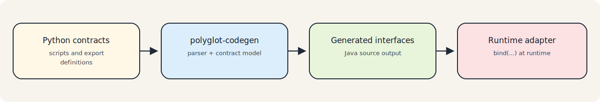

# Code Generation

## Overview

The code generation tooling complements the runtime adapter by turning supported guest-language contracts into Java source files.

It is build-time tooling, not runtime execution:

- it does not create GraalVM contexts
- it does not execute guest-language code
- it does not depend on the adapter runtime implementation

> Note
> Code generation is optional. The runtime adapter can be used with handwritten Java interfaces or with generated ones.

## Modules

### `polyglot-codegen`

This module contains the generation pipeline:

- `ContractGenerator` and `DefaultContractGenerator`
- parser dispatch by `SupportedLanguage`
- Python contract parsing
- Java type rendering
- Java interface generation
- a CLI entry point

### `polyglot-codegen-maven-plugin`

This module integrates the generator with Maven. It:

- scans an input directory
- filters supported script files by extension
- invokes the generator
- writes Java output
- registers the generated sources directory with Maven

## How Code Generation Works

The implemented pipeline is:

1. walk the configured input directory
2. detect the language from the file extension
3. create a `ScriptDescriptor`
4. parse the source into a `ContractModel`
5. render one Java interface per discovered contract
6. write the result under the configured Java package

The generator is deterministic:

- imports are collected and sorted
- interface source is rendered from the shared model
- generated files include a checksum header based on the rendered interface body

## Parser Responsibilities

Language parsers convert source syntax into the adapter’s language-neutral contract model.

### Python Parser

`PythonContractParser` is the only fully implemented parser today. It:

- looks for `polyglot.export_value(...)`
- detects whether the export points to a class or a dictionary-style function map
- extracts method signatures
- respects `CodegenConfig.onlyIncludedMethods()`
- skips private methods by default
- maps Python type hints into `PolyType`

The Python parser is intentionally lightweight and convention-oriented. It is designed for adapter contracts, not for full Python semantic analysis.

#### Class-Style Exports

The parser matches `class` definitions with or without base classes:

```python
class ForecastService:          # no base class
class ForecastService(Protocol): # single base class
class ForecastService(BaseA, BaseB): # multiple base classes
class ForecastService (Base):   # space before parentheses
```

Only the class name is captured; base class names are ignored by the parser.

#### Multiple Exports Per File

A single Python file may contain multiple `polyglot.export_value(...)` declarations. Each
declaration produces one `ContractClass` in the resulting `ContractModel`, and the Maven plugin
generates one Java interface file per class:

```python
polyglot.export_value("OrderService", OrderService)
polyglot.export_value("InventoryService", InventoryService)
```

Contracts are returned in source order (the order `polyglot.export_value(...)` lines appear in
the file).

#### Duplicate Export Names

If two or more `polyglot.export_value(...)` declarations in the same file use the same API name,
`parse(...)` fails immediately with an `IllegalStateException` that includes the duplicate name.
This check runs in all modes, not only in `strictMode`.

```python
# This will fail at parse time:
polyglot.export_value("Api", ClassA)
polyglot.export_value("Api", ClassB)  # duplicate name → IllegalStateException
```

Supported subset today:

- `polyglot.export_value(...)` with a class export or dictionary-style export
- multiple `polyglot.export_value(...)` declarations per file
- class definitions with optional base classes
- top-level Python functions used in exported dictionaries
- class methods and basic type hints aligned with the repository type model

Not promised today:

- full Python parsing fidelity
- semantic import resolution
- runtime-equivalent understanding of arbitrary Python constructs
- JavaScript contract generation

### JavaScript Parser

`JsContractParser` exists as an extension point only. It currently throws `UnsupportedOperationException`, so JavaScript code generation is not supported in the current version.

## Type Mapping

The type model used by code generation is intentionally small:

- `PolyPrimitive`
- `PolyList`
- `PolyMap`
- `PolyObject`
- `PolyUnion`
- `PolyUnknown`

Current Java rendering behavior is conservative:

- primitives map to boxed Java types
- lists map to `List<T>`
- maps map to `Map<K, V>`
- unsupported or richer types fall back to `Object`

## Maven Plugin Usage

The Maven plugin goal is:

```text
polyglot:generate
polyglot:check
polyglot:doctor
```

Default behavior:

- phase: `generate-sources`
- input directory: `${project.basedir}/src/main/resources`
- output directory: `${project.build.directory}/generated-sources/polyglot`
- base package fallback: `${project.groupId}.polyglot`

The plugin adds the output directory as a compile source root, so generated interfaces are compiled automatically in the same build.

Additional Maven plugin options:

- `onlyIncludedMethods` (default: `false`)  
  When enabled, only methods marked with `@adapter_include` are generated.
- `strictMode` (default: `false`)  
  Fails generation if unresolved/unknown types are detected in parsed contracts.
  This prevents silently propagating `Object`-like contracts into generated APIs.
- `failOnNoContracts` (default: `false`)  
  Fails the build if scanning finishes with zero generated contracts.
- `skipUnchanged` (default: `true`)  
  Skips rewriting generated files when rendered content is unchanged.
- `failOnContractDrift` (default: `false`)  
  In `polyglot:generate`, switches to drift-check behavior and fails when generated files differ.

DX workflow pattern:

- local update: `mvn polyglot:generate`
- CI verification: `mvn polyglot:check`
- local diagnostics alias: `mvn polyglot:doctor` (same behavior as `check`)

Recommended policy:

- use `strictMode=true` for contracts that are intended to become stable Java-facing APIs
- use `polyglot:check` in CI to detect drift without rewriting files
- treat `polyglot:doctor` as a local diagnostic convenience, not as a separate behavior contract

## Relationship to Runtime Execution

The code generation layer and the runtime adapter are separate by design, but they are intended to be used together.

Generated interfaces can be bound at runtime through:

- `PyExecutor`
- `JsExecutor`
- the Spring Boot starter

That is why the build tools follow the same naming conventions and contract model expected by the runtime adapter.

### Generated Interfaces and Spring Binding

Generated Java interfaces are plain interfaces with no framework annotations. To use a generated
interface with the Spring Boot starter, you must annotate it with `@PolyglotClient` and enable
client scanning:

```java
@PolyglotClient(languages = {SupportedLanguage.PYTHON})
public interface ForecastService {
    // generated methods
}
```

```java
@EnablePolyglotClients
@SpringBootApplication
public class MyApplication { ... }
```

The code generator does not add `@PolyglotClient` automatically. That annotation must be present
on the interface (either hand-written or added after generation) before the Spring starter can
register the corresponding bean.


