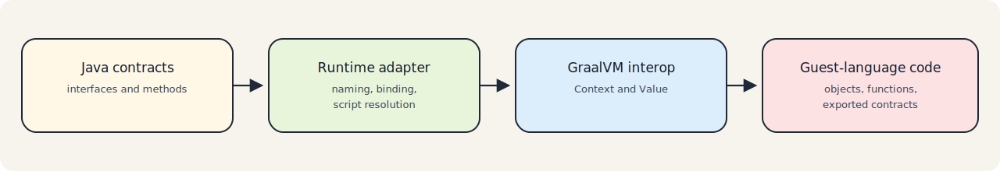

# Concepts

## GraalVM Polyglot Execution

GraalVM Polyglot lets one JVM application execute code written in other languages through a shared runtime. The low-level API revolves around:

- `Context` for language execution and interop
- `Source` for code loading
- `Value` for guest-language objects, functions, and results

`polyglot-adapter` does not replace that API. It acts as an adapter layer on top of it.

> Note
> If you already know GraalVM Polyglot, the main value here is convention, structure, and runtime integration ergonomics.

## The Adapter Abstraction

The main idea is to adapt guest-language code to Java interfaces.

Instead of writing code like this at every call site:

- create or customize a GraalVM `Context`
- open script resources
- call `context.eval(...)`
- locate members on `Value`
- convert results manually

the runtime adapter lets applications work with:

- a contract interface
- an executor
- a `ScriptSource`

That gives Java code a more stable surface without hiding the underlying GraalVM model.

## Contract Convention

The default convention connects Java contracts to dynamic-language code by name.

For a Java interface such as `ForecastService`:

- the runtime adapter looks for `forecast_service.py` or `forecast_service.js`
- Python exports are expected to use `ForecastService`
- Java method names are mapped to guest-language function or member names

This convention is represented in the public API by `Convention.DEFAULT`.

## ScriptSource

`ScriptSource` is the abstraction that separates script lookup from execution.

It answers two questions:

- does a logical script exist for a given language?
- how can the runtime adapter open it?

That separation allows the same executor code to work with:

- classpath resources
- filesystem scripts
- in-memory scripts
- composite fallback chains
- Spring `ResourceLoader` based sources

## Binding Model

`bind(Class<T>)` creates a Java proxy for a contract interface.

The proxy:

- maps Java method names to guest-language calls
- delegates invocation to the language-specific executor
- converts results using GraalVM interop

This is why the adapter is best described as a runtime adapter or lightweight wrapper around the GraalVM Polyglot API.

## Python and JavaScript Differences

The runtime adapter supports both Python and JavaScript, but their binding models are not identical.

### Python

`PyExecutor` supports:

- class-style exports, where the exported value is executable and instantiated
- dictionary-style exports, where methods come from a function map

### JavaScript

`JsExecutor` expects:

- one script per Java contract
- executable functions in JavaScript language bindings with names matching Java methods

## Contract Model for Code Generation

The build tools use a language-neutral contract model so parsing and rendering are separated cleanly.

Core records:

- `ContractModel`
- `ContractClass`
- `ContractMethod`
- `ContractParam`

Portable types:

- `PolyPrimitive`
- `PolyList`
- `PolyMap`
- `PolyObject`
- `PolyUnion`
- `PolyUnknown`

This model is intentionally smaller than any one guest language. It exists to support stable Java generation for the adapter API.
