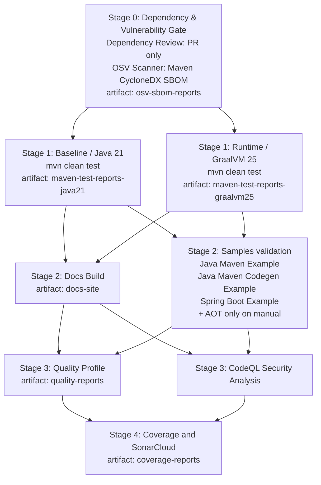

# Developer Tooling

This repository exposes one public Task interface:

- root `Taskfile.yaml`

Implementation details live under:

- `.dev/bin/*`: implementation scripts behind the public Task commands
- `.dev/lib/*`: shared shell helpers used by those scripts

Developer automation scripts require `bash`. Maven commands should be run through `./mvnw`.

## First-Time Setup

After cloning the repository:

```bash
sdk env
task dev:setup
```

`task dev:setup` enables repository-local Git hooks for the current clone, runs a lightweight
local validation step, does not publish artifacts, and does not require Maven Central or GPG
secrets. Hooks are not enabled automatically after clone.

To enable only the local hooks without running the full setup flow:

```bash
task dev:hooks
```

## Contributor Commands

Common contributor commands:

```bash
task verify
task quality
task samples
task format
task docs:serve
task docs:build
task docs:clean
```

What they do:

- `task dev:setup`: configure local hooks and run a lightweight validation for this clone
- `task dev:hooks`: configure only the local Git hooks for this clone
- `task verify`: run the standard repository verification path
- `task quality`: run the stricter local quality gate
- `task samples`: install local artifacts and verify maintained samples
- `task format`: apply Spotless formatting
- `task docs:serve`: start the local MkDocs development server
- `task docs:build`: run a strict local documentation build
- `task docs:clean`: remove local MkDocs site output

## Continuous Integration

GitHub Actions CI lives in `.github/workflows/ci.yml`. It runs on pull requests, pushes to `main`,
and manual `workflow_dispatch` runs. CI is intentionally separate from release and publishing:
release verification and GitHub Release creation stay in `.github/workflows/release.yaml`, while
Maven Central publishing stays manual in `.github/workflows/publish.yaml`.

Dependency Review runs only for pull requests. OSV Scanner runs for pull requests, pushes to
`main`, and manual CI runs. CI first generates a Maven CycloneDX aggregate SBOM with
`./mvnw -B -ntp -Psbom -DskipTests verify`, then OSV scans only that SBOM; it does not recursively
scan the whole repository in CI. CodeQL remains the code security analysis gate, and Renovate remains
responsible for dependency and GitHub Actions updates. Snyk is no longer required for CI. Regular
samples run on normal pull request and `main` push CI. AOT sample validation is manual-only through
`workflow_dispatch`, and the CI matrix excludes those AOT entries on normal pull request and push
runs so they do not appear as skipped jobs.



## Build And Inspection Commands

Useful local commands outside the basic contributor flow:

```bash
task build
task test
task clean
task version
```

- `task build`: build the project
- `task test`: run the test phase
- `task clean`: remove Maven build output and generated files
- `task version`: print the current project version

## Maintainer And Release Commands

These commands are maintainer-oriented and are not part of the normal first-time contributor path:

```bash
task release:preflight
task release:preflight:clean
task release:dry-run
task release -- 1.2.3
task version:bump -- patch
```

- `task release:preflight`: run the required local gate before preparing a release
- `task release:preflight:clean`: run the same preflight and remove the temporary docs virtualenv afterwards
- `task release:dry-run`: verify release publication locally without publishing to Maven Central
- `task release -- <version>`: prepare, tag, and push a release without publishing to Maven Central
- `task version:bump -- patch`: move the project to the next snapshot line after a release

## Safety Notes

- `task dev:setup` affects only the current clone when enabling hooks.
- `task release` does not publish to Maven Central.
- Maven Central publishing is manual-only through the GitHub Actions publish workflow.
- The release preflight and release commands are intentionally separate from normal contributor commands.
- `task docs:serve` cleans the temporary `site/` output on exit or interruption.
- `.venv-docs` is preserved across local docs runs for reuse.
- Direct use of `.dev/bin/*` is considered advanced/internal usage for toolkit maintenance and debugging.
