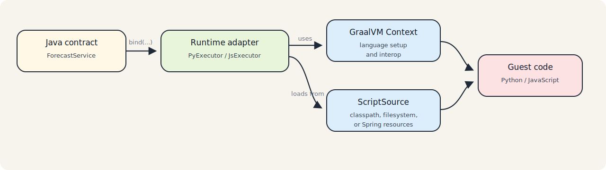

# Getting Started

This guide follows the repository sample flow and introduces the runtime adapter using the same onboarding terminology.

This example shows how to integrate Python code into a Java application using `polyglot-adapter`.

Instead of interacting directly with the low-level [GraalVM Polyglot API](https://www.graalvm.org/sdk/javadoc/org/graalvm/polyglot/package-summary.html), the application uses the adapter API as a lightweight integration layer.
The runtime adapter handles script loading and typed method binding so Java code can call dynamic-language logic through normal Java interfaces.

> Note
> The adapter API builds on the GraalVM Polyglot API. You still use GraalVM runtimes and language dependencies directly.

## Review the Sample Application

The adapter model is:

1. Define a Java interface for the guest-language API.
2. Implement that API in Python or JavaScript.
3. Export or expose the guest implementation using the adapter convention.
4. Bind the Java interface through an executor and call it like ordinary Java code.

The approach demonstrates how to:

- expose a guest-language API
- call dynamic-language code through a typed Java interface
- separate script lookup from execution through `ScriptSource`
- execute the integration on the JVM

The interaction between Java and guest-language code is managed by runtime adapter components such as `PyExecutor` and `JsExecutor`.

### Implementation Details

The default convention is:

- Java interface name: `ForecastService`
- Python script: `forecast_service.py`
- JavaScript script: `forecast_service.js`
- Python export name: `ForecastService`

For Python, the implementation exports a value using `polyglot.export_value`:

```python
import polyglot

class ForecastService:
    def forecast(self, data, steps, season_period=4):
        return {"forecast": data[:steps], "season_period": season_period}

polyglot.export_value("ForecastService", ForecastService)
```

On the Java side, the adapter resolves the exported contract and binds it to the interface:

```java
import java.nio.file.Path;
import java.util.List;

import io.github.ih0rd.adapter.context.PyExecutor;
import io.github.ih0rd.adapter.spi.FileSystemScriptSource;

FileSystemScriptSource scripts = new FileSystemScriptSource(Path.of("src/main"));

try (PyExecutor executor = PyExecutor.create(scripts, null)) {
  ForecastService service = executor.bind(ForecastService.class);
  System.out.println(service.forecast(List.of(1.0, 2.0, 3.0), 2, 4));
}
```

Without the exported value and the naming convention, the runtime adapter would have no contract to bind.



## Prerequisites

- Runtime modules: JDK 25, GraalVM 25.x, Maven 3.9+
- Build tools: JDK 21+, Maven 3.9+
- add only the GraalVM language runtimes you use

When working from this repository checkout, activate the pinned SDKMAN environment first:

```bash
sdk env
```

If you want aligned runtime dependency versions, import `polyglot-bom` first.

## Package and Run on a JVM

Add the runtime BOM:

```xml
<dependencyManagement>
  <dependencies>
    <dependency>
      <groupId>io.github.ih0r-d</groupId>
      <artifactId>polyglot-bom</artifactId>
      <version>${polyglot.version}</version>
      <type>pom</type>
      <scope>import</scope>
    </dependency>
  </dependencies>
</dependencyManagement>
```

Use the latest published release for `${polyglot.version}`. The `main` branch currently carries
the open `0.3.1-SNAPSHOT` development line.

Add the adapter and the language runtime:

```xml
<dependencies>
  <dependency>
    <groupId>io.github.ih0r-d</groupId>
    <artifactId>polyglot-adapter</artifactId>
  </dependency>

  <dependency>
    <groupId>org.graalvm.python</groupId>
    <artifactId>python-embedding</artifactId>
  </dependency>
  <dependency>
    <groupId>org.graalvm.python</groupId>
    <artifactId>python-launcher</artifactId>
  </dependency>
</dependencies>
```

Place scripts in a location that matches your chosen `ScriptSource`:

- `ClasspathScriptSource`: `python/forecast_service.py`, `js/forecast_service.js`
- `FileSystemScriptSource`: `{baseDir}/python/...`, `{baseDir}/js/...`
- `SpringResourceScriptSource`: one configured base path per language

## Build and Run a Native Image

The core adapter is designed for GraalVM-based applications, but a repository-wide native-image guide is not maintained in the current documentation set.
Use the native-image build setup from an application-specific sample when native packaging is part of your deployment target.

## Why Use the Adapter Instead of the Raw Polyglot API?

You can implement the same integration directly with `Context` and `Value`, but the runtime adapter standardizes the repetitive integration work:

- script loading is delegated to `ScriptSource`
- guest-language binding is exposed through normal Java interfaces
- the naming convention keeps contracts aligned across Java and dynamic-language code
- binding validation can fail early instead of surfacing later at call sites
- Spring integration becomes a thin configuration layer instead of custom runtime plumbing

Let’s summarize why you would use the adapter API on top of the GraalVM Polyglot API:

- Stronger Java typing: call guest-language code through Java interfaces instead of string-based member lookups.
- Less integration code: context creation, script lookup, binding, and invocation are centralized in adapter runtime components.
- Better maintainability: script names and exported contract names follow one convention instead of scattered string constants.
- Easier framework integration: the Spring Boot starter builds on the same runtime adapter rather than reimplementing polyglot wiring.

### What changes when using the runtime adapter instead of the raw GraalVM Polyglot API?

_Script loading_

- GraalVM Polyglot API: application code loads and evaluates scripts directly
- Runtime adapter: the application configures a `ScriptSource` and binds by interface

_Invocation_

- GraalVM Polyglot API: call sites interact with `Value` and member lookups directly
- Runtime adapter: typed calls go through `bind(...)`

_Naming conventions_

- GraalVM Polyglot API: names are often managed as ad hoc strings
- Runtime adapter: interface names, script names, and Python export names follow one convention
