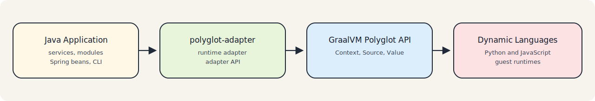

# Overview

`polyglot-adapter` is a multi-module toolkit for dynamic-language integration built on top of the GraalVM Polyglot API.

> Note
> This project wraps the GraalVM Polyglot API to simplify runtime integration. It does not replace GraalVM or introduce a separate execution runtime.

It should be understood as:

- an adapter API extending the GraalVM Polyglot API
- a runtime adapter for Java applications
- a lightweight wrapper for guest-language execution
- a GraalVM polyglot integration layer

Instead of having every application work directly with low-level `Context` and `Value` calls, the adapter adds a higher-level runtime model:

- Java interfaces define the contract visible to application code
- `ScriptSource` abstracts where scripts come from
- `PyExecutor` and `JsExecutor` implement convention-based binding
- the Spring Boot starter turns those executors into injectable clients
- the code generation tooling produces Java interfaces from Python contracts

## Problem It Solves

The raw GraalVM Polyglot API is powerful, but once an application grows beyond a simple script call it usually needs additional structure around:

- loading scripts from classpath, filesystem, or packaged resources
- keeping Java contract names aligned with dynamic-language exports
- validating bindings at startup
- converting repeated `Value` lookups into maintainable Java APIs
- integrating polyglot execution into Spring applications

`polyglot-adapter` addresses those problems without replacing GraalVM. It keeps the runtime layer thin while adding reusable build and integration tooling around it.

## Repository Layout

The repository is organized into three logical layers:

- `api`: shared annotations and model types
- `runtime`: adapter execution, Spring integration, and dependency management
- `build-tools`: static analysis and code generation

See:

- [Getting Started](getting-started.md)
- [Concepts](concepts.md)
- [Architecture](architecture.md)
- [Compatibility](compatibility.md)
- [Runtime](runtime.md)
- [Code Generation](codegen.md)
- [Examples](examples.md)
