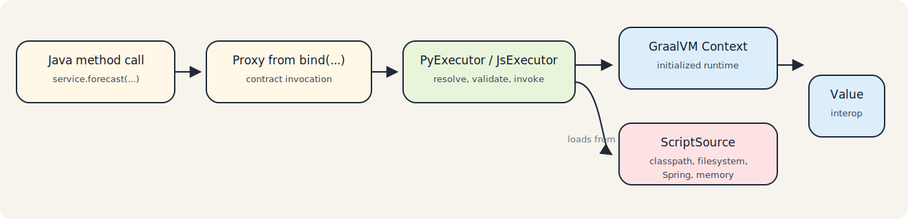

# Runtime

## Overview

The runtime layer provides the adapter API on top of GraalVM Polyglot for Python and JavaScript execution.

Its core purpose is simple: bind a Java interface to a guest-language implementation and call it as normal Java code.

> Note
> The runtime adapter is intended for trusted application embedding. It is not a sandboxing framework.

## Core Runtime Module

`runtime/polyglot-adapter` is framework-neutral and contains the execution model used by every integration style.

### Main Components

- `AbstractPolyglotExecutor`: shared proxy binding, source caching, metadata, and common invocation helpers
- `PyExecutor`: Python-specific script loading, export resolution, instance caching, and binding validation
- `JsExecutor`: JavaScript-specific script loading, function lookup, and binding validation
- `PolyglotHelper`: language-specific `Context` creation and initialization
- `ScriptSource` implementations: classpath, filesystem, in-memory, and composite resolution

## How Runtime Execution Works



### Context Creation

`PolyglotHelper` creates a language-specific `Context.Builder`, applies an optional customizer, builds the context, and calls `context.initialize(languageId)`.

Current defaults:

- `allowAllAccess(true)`
- `allowExperimentalOptions(true)`
- interpreter-only warnings disabled
- Python experimental feature warnings disabled

For Python, context creation uses `GraalPyResources.contextBuilder(...)` with a virtual file system. For JavaScript, it uses the regular `Context.newBuilder(...)`.

These defaults are designed for application embedding through the adapter, not for hostile multi-tenant sandboxing.

### Script Resolution

Executors never read the filesystem or classpath directly. They ask `ScriptSource` whether a logical script exists and open it through a `Reader`.

Logical names are derived from interface names:

- `StatsApi` -> `stats_api`
- `ForecastService` -> `forecast_service`

The actual physical path depends on the chosen `ScriptSource`.

### Binding and Invocation

`bind(Class<T>)` creates a JDK dynamic proxy. Each interface method becomes a guest-language method call with the same method name.

At invocation time:

- the proxy delegates to the executor
- the executor resolves or loads the guest script
- the guest function or object member is invoked through GraalVM `Value`
- the result is converted back through `Value.as(returnType)`

If the guest result is `null`, the proxy returns `null`.

## Python Runtime Details

`PyExecutor` is convention-driven.

### Expected Layout

- Java interface: `ForecastService`
- script: `forecast_service.py`
- export name: `ForecastService`

### Supported Export Styles

Class-style export:

```python
polyglot.export_value("ForecastService", ForecastService)
```

Dictionary-style export:

```python
polyglot.export_value(
    "ForecastService",
    {
        "forecast": forecast
    }
)
```

The executor:

- evaluates the script
- resolves the export from polyglot bindings first, then Python bindings
- instantiates callable exports
- reuses dictionary-style exports directly
- caches resolved targets per interface using weak references

`validateBinding(...)` resolves the instance eagerly, so it is useful at startup when applications want to fail early.

### Python Lifecycle And Cache Semantics

- Source cache is keyed by Java interface type.
- Instance cache is keyed by Java interface type and stored via weak references.
- `clearSourceCache()` clears only source entries; live Python instances remain reusable until instance cache is invalidated.
- `invalidateContractCache(iface)` evicts source + instance entries for that single contract.
- `reloadContract(iface)` is a focused helper: evict that contract cache and eagerly re-validate it.
- Script changes are not auto-detected. To pick up changed code, invalidate/reload the affected contract or recreate the executor.

The more explicit repository-level contract for these behaviors is documented in
[`runtime-semantics.md`](runtime-semantics.md).

## JavaScript Runtime Details

`JsExecutor` uses the same script naming convention but a different binding model.

Expected layout:

- Java interface: `ForecastService`
- script: `forecast_service.js`
- functions in JS bindings: `forecast(...)`

When a Java interface is validated or called:

- the script is evaluated once and cached by interface
- each interface method must exist as an executable JavaScript function
- method calls are executed from language bindings

The runtime does not currently define a separate JavaScript export object convention comparable to Python's class-style and dictionary-style exports.

JavaScript support is intentionally narrower than Python in this release line and should be treated as runtime-only binding support, not parity with Python lifecycle semantics.

## Adapter API Surface

Applications normally interact with the runtime through:

- `PyExecutor.create(...)` or `PyExecutor.createWithContext(...)`
- `JsExecutor.create(...)` or `JsExecutor.createWithContext(...)`
- `bind(...)`
- `bind(..., convention)`
- `validateBinding(...)`
- `validateBinding(..., convention)`
- `metadata()`

`metadata()` returns a lightweight snapshot intended for diagnostics, actuator info, or metrics. It is not a stable serialization format.

## Binding Conventions

The runtime currently exposes three convention values:

- `DEFAULT`
- `BY_INTERFACE_EXPORT`
- `BY_METHOD_NAME`

Current behavior:

- Python:
  - `DEFAULT`: backward-compatible export-based binding
  - `BY_INTERFACE_EXPORT`: explicit export-object/class convention
  - `BY_METHOD_NAME`: direct function lookup from bindings by Java method name
- JavaScript:
  - `DEFAULT`: function lookup by method name
  - `BY_METHOD_NAME`: same runtime path as `DEFAULT`
  - `BY_INTERFACE_EXPORT`: rejected explicitly

Important compatibility note:

- Python invocation behavior under `DEFAULT` remains aligned with the historical export-based path.
- Python validation under `DEFAULT` is now stricter: if the exported contract exists but required Java methods are missing or not executable, `validateBinding(...)` fails earlier than before.

## Spring Boot Starter

`runtime/polyglot-spring-boot-starter` wraps the runtime adapter for Spring applications.

### What It Provides

- `PolyglotAutoConfiguration`
- `PolyglotPythonAutoConfiguration`
- `PolyglotJsAutoConfiguration`
- `SpringPolyglotContextFactory`
- `PolyglotExecutors`
- `@EnablePolyglotClients`
- `PolyglotClientRegistrar`
- `PolyglotClientFactoryBean`
- actuator contributors
- Micrometer meter binder
- startup warmup lifecycle

### How Users Interact With the Runtime Adapter in Spring

1. Add the starter and language runtime dependencies.
2. Enable the desired languages under `polyglot.*`.
3. Annotate interfaces with `@PolyglotClient`.
4. Enable scanning with `@EnablePolyglotClients`.
5. Inject the generated Spring beans as normal interfaces.

If `@EnablePolyglotClients` does not declare `basePackages`, the starter scans the package of the
importing configuration class.

Language resolution rules for `@PolyglotClient` are enforced by `PolyglotClientFactoryBean`:

- one explicit language: use that executor
- multiple explicit languages: fail
- no explicit language and exactly one executor available: use it
- no explicit language and multiple executors available: fail and require explicit configuration

## Spring Configuration

Current configuration properties live under `polyglot.*`.

Core properties:

- `polyglot.core.enabled`
- `polyglot.core.fail-fast`
- `polyglot.core.log-metadata-on-startup`
- `polyglot.core.log-level`

Python properties:

- `polyglot.python.enabled`
- `polyglot.python.resources-path`
- `polyglot.python.safe-defaults`
- `polyglot.python.warmup-on-startup`
- `polyglot.python.preload-scripts`

JavaScript properties:

- `polyglot.js.enabled`
- `polyglot.js.resources-path`
- `polyglot.js.warmup-on-startup`
- `polyglot.js.preload-scripts`

Operational properties:

- `polyglot.metrics.enabled`
- `polyglot.actuator.enabled`
- `polyglot.actuator.info.enabled`
- `polyglot.actuator.health.enabled`

Starter behavior:

- `polyglot.core.fail-fast=true` eagerly instantiates discovered `@PolyglotClient` beans during
  startup so invalid contracts fail before the application begins serving requests.
- `polyglot.core.log-metadata-on-startup=true` emits a single startup summary at the configured
  `polyglot.core.log-level`.
- `polyglot.python.preload-scripts` and `polyglot.js.preload-scripts` evaluate the listed logical
  scripts during startup after warmup. These names are resolved through the configured
  `ScriptSource`; they are not interface names, they do not populate interface caches, and repeated
  evaluation or repeated script side effects remain possible on later contract binding.
- `polyglot.python.safe-defaults=true` applies the starter's recommended GraalPy defaults. When
  disabled, the starter creates a more minimal Python context and expects applications to provide
  their own `PolyglotContextCustomizer` beans if they need additional options.

## Operational Behavior

If actuator is present, the starter can expose:

- a health indicator that reports whether at least one executor is available
- an info contributor with configuration and executor availability

If Micrometer is present, the starter registers gauges for:

- executor enablement
- source cache size
- Python instance cache size
- count of Python bound interfaces
- count of JavaScript loaded interfaces

## Current Runtime Limits

- The runtime is intended for trusted application embedding, not untrusted sandbox execution.
- JavaScript execution is supported, but JavaScript contract generation is not.
- Startup preloading evaluates named scripts but does not provide hot reload or source versioning.
- Startup preloading is raw script evaluation, not true contract prebinding.
- The binding convention is currently opinionated and name-based; alternative conventions are not implemented yet.
- Starter-managed executors are shared singleton beans that serialize access to the underlying
  GraalVM `Context`. They are intended for concurrent Spring application use, but contract loading
  and cache invalidation remain per-executor concerns.
- Source caching is keyed by Java interface. Python target instances are cached per interface using
  weak references. Changing a script after startup does not trigger automatic reload; clear caches
  or recreate the executor if you need to pick up changed sources.
